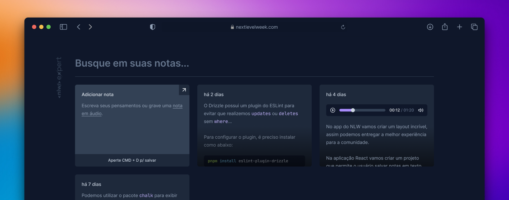

<p align="center" >
  
</p>

<p align="center">
  
  
  
  
  
  
  
</p>

<p align="center">
  <a href="#-technologies">Technologies</a>&nbsp;&nbsp;&nbsp;|&nbsp;&nbsp;&nbsp;
  <a href="#-project">Project</a>&nbsp;&nbsp;&nbsp;|&nbsp;&nbsp;&nbsp;
  <a href="#-layout">Layout</a>&nbsp;&nbsp;&nbsp;|&nbsp;&nbsp;&nbsp;
  <a href="#-license">License</a>
</p>

<p align="center">
  
</p>

<br>

<p align="center">
  
</p>

## 🚀 Technologies

This project was developed with the following technologies:

- **Framework**: React
- **Language**: TypeScript
- **Styling**: Tailwind CSS
- **Voice Processing**: Web Speech API (SpeechRecognition)
- **Icon Library**: Lucide React
- **Toast Component**: Sonner

## 🚧 Project

Expert Notes is a modern web application built with React designed to streamline how you capture ideas. Whether you prefer the tactile feel of your keyboard or the speed of your voice, this app provides a seamless interface to write, save, and manage your thoughts.

## 🧰 Prerequisites

- Node.js (version 18 or later)
- `npm` or `yarn`

## 🌐 Browser Compatibility

This project utilizes the Web Speech API, which is currently a premium feature with varying levels of support across browsers. For the best experience, please refer to the table below:

- Google Chrome ✅ **Full Support Recommended for best accuracy**

## 💻 How to run

```bash
# Clone the repository
git clone https://github.com/filipebteixeira98/expert-notes-web.git

# Access the project folder
cd expert-notes-web

# Install the dependencies
npm install

# Start the development server with Hot Module Replacement (HMR)
npm run dev
```

## 🫶 Contributing

Contributions are welcome! Please feel free to submit a Pull Request.

## 📝 License

This project is under the MIT license.

<p align="center">
  Made with ♥ by me
</p>
